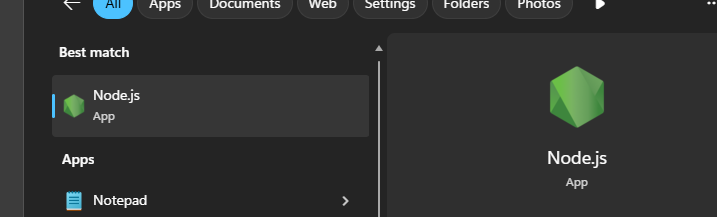
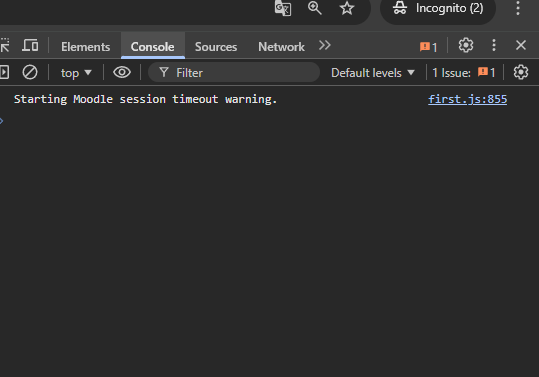
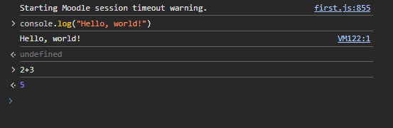
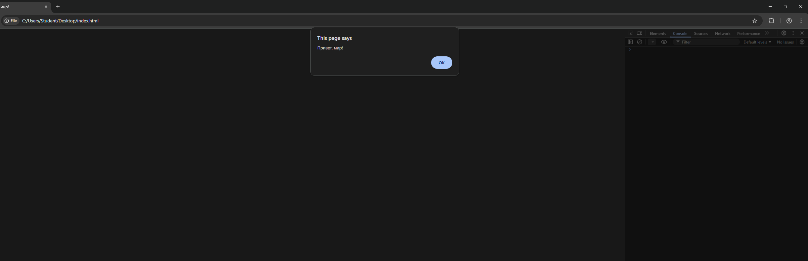
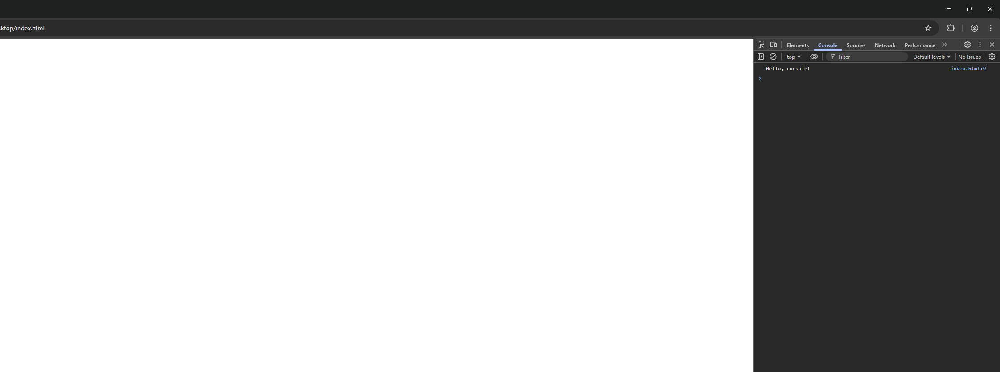
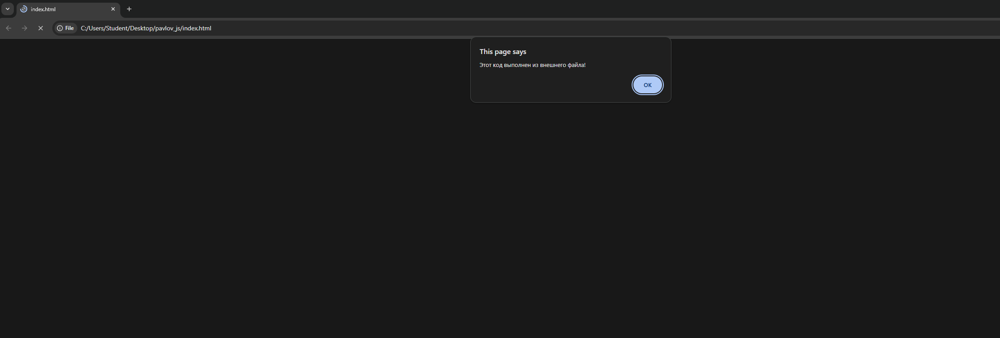

Первая лабораторная

1. Подготовка среды

установил Node js

2.

открыл консоль

написал hellow world

написал 2+3 получил 5

3.

создал index.html с кодом

<!DOCTYPE html>
<html lang="en">
 <head>
   <title>Привет, мир!</title>
 </head>
 <body>
   
 </body>
</html>

открыл в браузере

добавил скрипт

