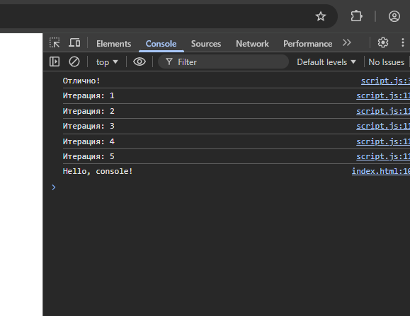

#Первая лабораторная
#ЗАДАНИЕ 1

1. Подготовка среды

установил Node js

2.

открыл консоль

написал hellow world

написал 2+3 получил 5

3.

создал index.html с кодом

<!DOCTYPE html>
<html lang="en">
 <head>
   <title>Привет, мир!</title>
 </head>
 <body>
   
 </body>
</html>

открыл в браузере

добавил скрипт

#ЗАДАНИЕ 2

1

const name = "sasha"
const birthYear = 1;
const isStudent = true;

console.log(name);
console.log(birthYear);
console.log(isStudent);

2

#КОНТРОЛЬНЫЕ ВОРПОСЫ

Чем отличается var от let и const?
var имеет функциональную область видимости и "поднимается" в начало кода, в то время как let и const имеют блочную область видимости, при этом const запрещает повторное присваивание значения переменной.

Что такое неявное преобразование типов в JavaScript?
Это автоматическое приведение JavaScript значений одного типа к другому (например, превращение числа в строку при сложении), чтобы выполнить операцию между разнородными данными.

Как работает оператор == в сравнении с ===?
Оператор == выполняет нестрогое сравнение с предварительным приведением типов, тогда как === выполняет строгое сравнение, проверяя одновременно и равенство значений, и идентичность их типов.
